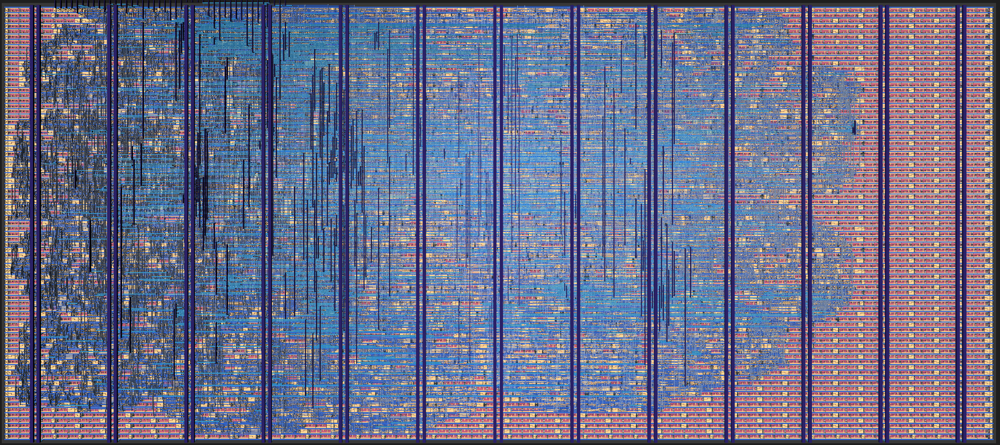
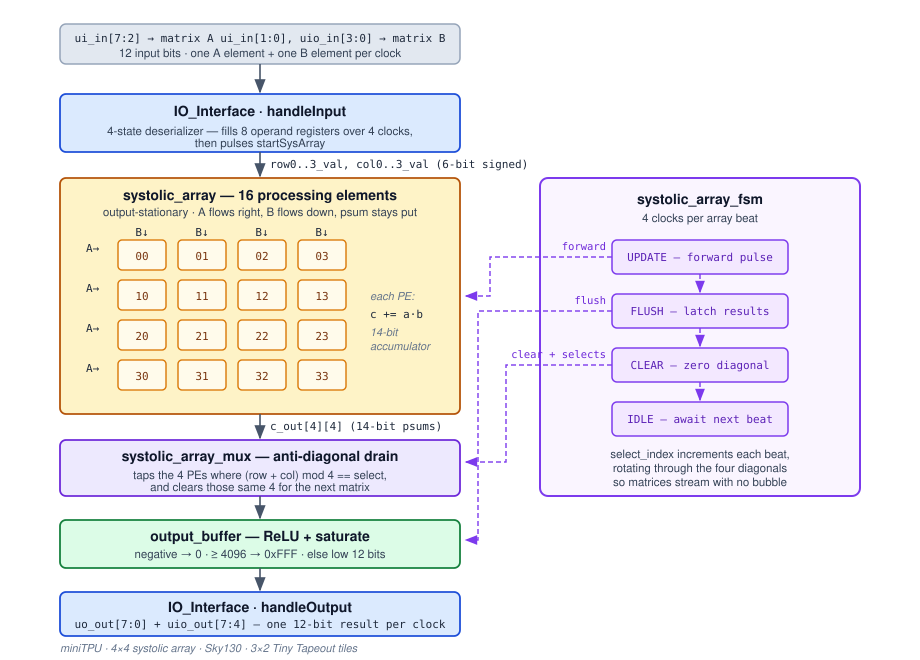
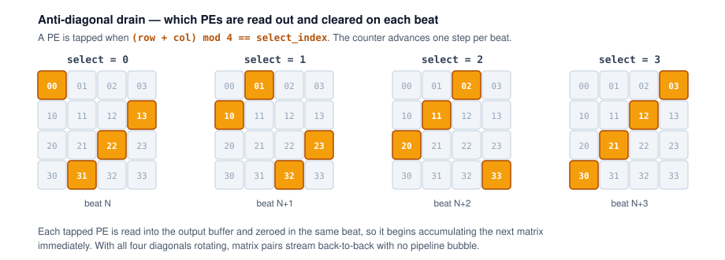

# miniTPU - A 4x4 INT6 Systolic Array Matrix Multiplier ASIC

A 4×4 systolic array that multiplies INT6 matrices and applies ReLU, built as an ASIC for Tiny Tapeout on SkyWater 130 nm. Inspired by Google's TPU v1.

  



<sup>The hardened layout. 16 processing elements, control logic and I/O, placed and routed across 3×2 Tiny Tapeout tiles. [Explore it in 3D →](https://hynixcjr.github.io/ttsky-miniTPU/)</sup>

| | |
|---|---|
| Compute | 4×4 × 4×4 integer matrix multiply, 16 MAC units, fused ReLU |
| Precision | INT6 operands (−32…31), 14-bit accumulate, 12-bit output after ReLU and saturation |
| Throughput | 4 MAC/clock, about 133 MMAC/s at 33 MHz (calculated, not measured) |
| Process | SkyWater Sky130A, hardened with LibreLane |
| Die area | 3×2 Tiny Tapeout tiles, roughly 501 × 216 µm |
| Clock | 33 MHz target, synthesis constrained at 20 ns |
| Interface | 12 input bits and 12 output bits across 24 GPIO |
| Language | SystemVerilog and Verilog-2001 |

## Results

The design hardens through LibreLane on Sky130A and clears all 15 Tiny Tapeout precheck items, which
is the manufacturability gate a design has to pass before it can go to a shuttle. Gate-level
simulation runs against the post-layout netlist, and a
[3D render of the layout](https://hynixcjr.github.io/ttsky-miniTPU/) is published on every build.

| | |
|---|---|
| Standard cells | 6,682, excluding fill and tap |
| Flip-flops | 496 |
| Die utilization | 62.7% |
| Total wire length | 169.2 mm |
| Precheck | 15 of 15 (Magic DRC, KLayout FEOL/BEOL/offgrid, pin, boundary, power, layer checks) |
| Gate-level sim | Passes on the hardened netlist |

Numbers are from [gds run #77](https://github.com/HynixCJR/ttsky-miniTPU/actions/runs/35283886424).
The cell mix runs about 30% combinational logic with roughly 3,200 cells of basic NAND/NOR/AND/OR
gates behind it, which is what you would expect from 16 MAC units and not much else.

## Architecture



Data comes in over 12 GPIO pins, one A element and one B element per clock. `IO_Interface` collects
four of each into the operand registers and then pulses the array forward. Results leave the same
way, 12 bits at a time.

| Module | Role |
|---|---|
| [`tt_um_4x4TPU.sv`](src/tt_um_4x4TPU.sv) | Top level, wires the submodules together |
| [`IO_Interface.v`](src/IO_Interface.v) | `handleInput` deserializes operands off the pins, `handleOutput` streams results back |
| [`PE.sv`](src/PE.sv) | The MAC unit. `c_reg += a_in * b_in`, and passes its operands right and down |
| [`systolic_array.sv`](src/systolic_array.sv) | 16 PEs in a generate nest, wired nearest-neighbour |
| [`systolic_array_fsm.sv`](src/systolic_array_fsm.sv) | Scheduler. Five states, four clocks per beat, rotating drain select |
| [`systolic_array_mux.sv`](src/systolic_array_mux.sv) | Reads finished PEs off the array and clears them |
| [`output_buffer.sv`](src/output_buffer.sv) | ReLU, saturation, and the cut down to 12 bits |

Operands have to arrive staggered: row *i* and column *i* start *i* beats late, padded with zeros on
the way in and out. The full load schedule is in [`docs/info.md`](docs/info.md).

| Signal | Pins |
|---|---|
| Matrix A element | `ui_in[7:2]`, 6-bit two's complement |
| Matrix B element | `ui_in[1:0]` and `uio_in[3:0]`, split across two ports |
| Result | `uo_out[7:0]` and `uio_out[7:4]`, 12-bit unsigned |

## Anti-diagonal drain

Because the operands arrive staggered, the 16 PEs don't finish their dot products at the same time.
The ones that finish together sit on an anti-diagonal.



A 2-bit counter in the FSM advances once per beat. On each beat the mux reads the four PEs where
`(row + col) mod 4 == select_index`, sends them to the output buffer, and routes a clear pulse back
to those same four.

The clear is the part that matters. A PE is zeroed in the same beat it gets read, so it starts
accumulating the next matrix while the other three diagonals are still working on the current one.
Nothing stalls between matrix pairs. For the first four beats the array is still filling, so
`is_first_matrix` holds the output back until there are real dot products to report.

## Design notes

**Output-stationary.** Partial sums stay put in the PEs and the operands move through them. We went
this way because the alternative needs an accumulator network hanging off the array, and on six tiles
there isn't room for one. The cost is that results finish on a diagonal instead of all at once, which
is what the drain mux exists to handle.

**Per-PE clear.** Each PE has its own clear line instead of sharing a global one. A global clear
would force the array to drain fully between matrices. Independent clears let each diagonal restart
on its own beat. The back-to-back streaming falls out of that.

**Four clocks per beat.** The array only advances once every four clocks. That isn't a throughput
target, it's what the pins allow. A beat needs eight operands at 6 bits each, and a Tiny Tapeout tile
gives us 12 input bits, so filling one takes four cycles.

That sets the ceiling. Four beats per matrix pair is about 16 clocks for a 4×4 multiply once the
pipeline is full, so 64 MACs over 16 clocks gives 4 MAC/clock, or roughly 133 MMAC/s at 33 MHz.
Calculated from the RTL schedule, not measured on hardware. PE utilization lands around 25%: the
array is waiting on I/O rather than arithmetic, and reworking the array wouldn't change that.

**Accumulator width.** A 6-bit signed product ranges from −992 to 1024, so 12 bits. Four of them
accumulate, which needs two more. Hence 14.

**ReLU placement.** ReLU is a sign-bit test on a value the output buffer already registers, so it
folds into that stage instead of adding one.

**Saturation.** The clamp to `0xFFF` gets hit in practice. (−32)² is 1024, and four of those is
exactly 4096, one past what 12 bits hold.

## Verification

Testbenches are cocotb driving Icarus Verilog, with Verilator for some runs. Each module has its own
bench and DUT wrapper, so a failure points at one module instead of at the whole chip.

| Suite | Scope | State |
|---|---|---|
| [`test/systolic_fsm/`](test/systolic_fsm/) | Control FSM | Self-checking. Asserts state encoding, `forward` pulse timing, output suppression on the first matrix, and `select_index` rollover |
| [`test/4x4TPU/`](test/4x4TPU/) | Full chip | Drives staggered, zero-padded matrix streams through the real pin protocol. Result checking not wired up yet |
| [`test/systolic_array/`](test/systolic_array/) | 16-PE array | Stimulus, read by waveform |
| [`test/IO_Interface/`](test/IO_Interface/) | Pin protocol | Exercises the input deserializer and the output streamer |
| [`test/systolic_mux/`](test/systolic_mux/) | Drain crossbar | Stub |

Four workflows run on every push: RTL simulation, GDS build, precheck, and gate-level simulation on
the hardened netlist. Waveforms and results come back as build artifacts.

The FSM bench is the only one that checks its own results. The full-chip test drives the right
stimulus but its assertions are still commented out, so correctness has been confirmed by reading
waveforms rather than by regression. Replacing that with a Python golden model and random matrix
streams is the next thing to do.

## Building and testing

Needs Python 3.11+, `iverilog` and `make`.

```sh
pip install -r test/requirements.txt

cd test
make -B                  # RTL simulation
make -B GATES=yes        # gate-level, needs test/gate_level_netlist.v
gtkwave tb.fst           # or: surfer tb.fst
```

Pushing to GitHub builds the GDS, runs the precheck and gate-level tests, and redeploys the viewer.
For local hardening see the [Tiny Tapeout guide](https://www.tinytapeout.com/guides/local-hardening/).

## Repository layout

```
src/                 RTL and the LibreLane config
test/                cocotb benches, one directory per unit under test
docs/                datasheet source and diagrams
.github/workflows/   gds, test, docs, fpga
info.yaml            Tiny Tapeout metadata and pinout
```

## Team

Built by [Albert Huang](https://github.com/dphhs), [Matthew Kong](https://github.com/HynixCJR), [Jiya Nair](https://github.com/Jiya-uoft) and [Rivera Wijaya](https://github.com/RiveraWijaya).

## License

[Apache-2.0](LICENSE). Built with [Tiny Tapeout](https://tinytapeout.com).
